# 🎲 Epicube Solver 🧩

Welcome to Epicube Solve !
It combines several libraries to create a virtual Rubik's Cube, allowing you to build, manipulate, and solve the cube through a user-friendly interface. For all this project we use the regular Rubik's Cube Move Notation (see below)


<br>
<br>


# Summary

1. [Project Components](#📦-project-components) <br>
    1.1 [RubiksCube Class](#🎲-rubikscube-class) <br>
    1.2 [Camera Module](#📸-camera-module) <br>
    1.3 [Rich Interface](#🖥️-rich-interface) <br>
    1.4 [Kociemba Solver](#🧠-kociemba-solver) <br>
2. [How It Works](#🚀-how-it-works)
3. [Getting Started](#🛠️-getting-started)
4. [Usage](#🕹️-usage) <br>
    4.1 [Building a Cube](#📝-building-a-cube) <br>
    4.2 [Manipulating the Cube](#🎮-manipulating-the-cube) <br>
    4.3 [Solving the Cube](#🏆-solving-the-cube) <br>
5. [Rubik's Cube Move Notation](#📝-rubiks-cube-move-notation)
6. [License](#📚-license)
7. [Contributing](#🤝-contributing)
8. [Contacts](#📫-contacts)


<br>
<br>


# 📦 Project Components

## 🎲 RubiksCube Class
This class represents the Rubik's Cube itself. It handles the cube's state, including its current configuration and the ability to perform moves on it. The cube is represented as a 3D array, where each layer is a 3x3 grid of colored squares.

<br>

## 📸 Camera Module
This module uses OpenCV (cv2) to interact with a physical Rubik's Cube. It can "scan" the cube to determine its initial state, allowing you to start solving from a real-world cube.

<br>

## 🖥️ Rich Interface
The Rich library provides a beautiful terminal interface for interacting with the cube. It allows you to build the cube manually, input moves, and view the cube's current state in a visually appealing manner.

<br>

## 🧠 Kociemba Solver
Underneath the hood, the Kociemba algorithm is used to solve the cube. This powerful algorithm efficiently finds a sequence of moves to solve the cube from any given state.


<br>
<br>


# 🚀 How It Works

1. **Building the Cube**: You can either build the cube manually by entering the colors for each square or use the camera to automatically detect the cube's initial state.
2. **Manipulating the Cube**: Once the cube is built, you can perform moves on it. The interface supports single moves (like rotating a face) and double moves (like rotating a face twice).
3. **Solving the Cube**: After building and manipulating the cube, you can use the Kociemba solver to find a sequence of moves that will solve the cube.
4. **Interacting with the Cube**: Throughout the process, the Rich interface provides a clear and engaging way to visualize the cube's state and track your progress.


<br>
<br>


## 🛠️ Getting Started

To get started follow those steps:

1. clone the repository
```bash
git clone https://github.com/dragusheen/EpicubeSolver
```

<br>

2. install the required dependencies
```bash
pip install rich
```
```bash
pip install opencv-python
pip install opencv-contrib-python
pip install opencv-python-headless
pip install opencv-contrib-python-headless
```
```bash
pip install kociemba
```

<br>

3. start the project
```bash
./epicubeSover
```

Be careful, this project was thinking to be use on linux !


<br>
<br>


# 🕹️ Usage

After launching the application, you'll be presented with options to create your cube, perform moves and actions, solve the cube, and more ! Use the correct key to select what u want to do.

<br>

## 📝 Building a Cube

You can build a cube in 2 differents ways :
- Generate a default one, a basic cube already solved.
- Building your own cube.

If you choose to build your own cube, you can do it :
- Manually, by selecting each color for each position
- Using the camera, by taking each face in picture. Be carefull, sometimes it's complicated for camera's to correctly distinguish each colors...

<br>

## 🎮 Manipulating the Cube

After you have build your cube well, you can start interact with it !
Some options are provided :
- **Move**: To perform one or more rotations on the cube.
- **Shuffle**: To shuffle the cube by a given number of movements.
- **Reset**: To restart with a solved cube.
- **View**: To see the cube.

<br>

## 🏆 Solving the Cube

Once the cube is built, you can solve it automatically using the `kociemba` algorithm.
Moreover the solution will be displayed in the console.


<br>
<br>


# 📝 Rubik's Cube Move Notation

This project use the regular Rubik's Cube Move Notation.
It have to be taken with:
- White as the top color
- Orange as the left color
- Green as the front color
- Red as the right color
- Blue as the back color
- Yellow as the down color

The basic moves are **U**p, **D**own, **R**ight, **L**eft, **F**ront, **B**ack.
- Each move means to turn that side clockwise, as if you were facing that side

| U | D | R | L | F | B |
|:---------:|:---------:|:---------:|:---------:|:---------:|:---------:|
| 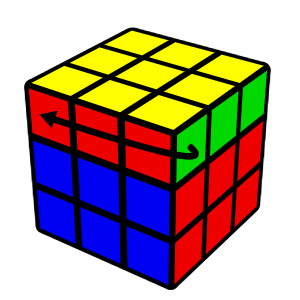 | 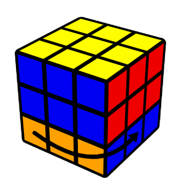 | 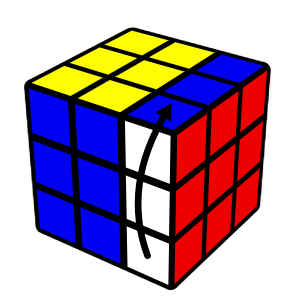 | 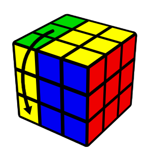 | 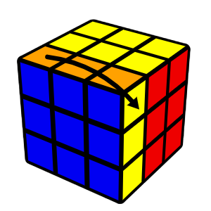 | 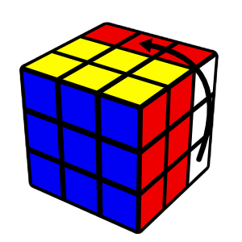

<br>

- An apostroph (pronouced as *prime*) means to turn the face in the opposite direction (*counterclockwise*).

| U' | D' | R' | L' | F' | B' |
|:---------:|:---------:|:---------:|:---------:|:---------:|:---------:|
|  |  |  |  |  | 

<br>

- The number 2 means to turn that face twice.

| U2 | D2 | R2 | L2 | F2 | B2 |
|:---------:|:---------:|:---------:|:---------:|:---------:|:---------:|
| 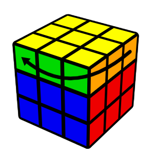 | 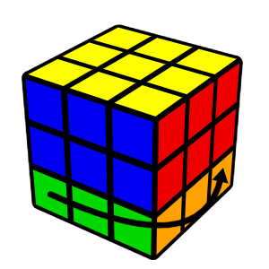 | 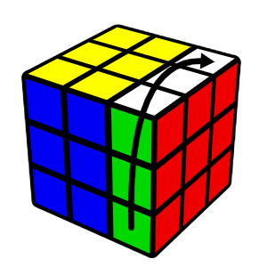 | 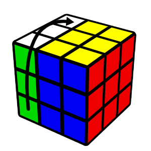 | 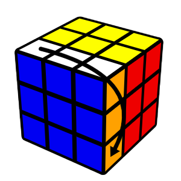 | 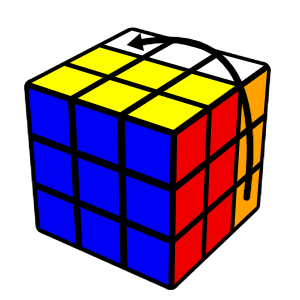


<br>
<br>


## 📚 License

This project is licensed under the MIT License - see the LICENSE file for details.


<br>
<br>


## 🤝 Contributing

Contributions are what make the open-source community such an amazing place to learn, inspire, and create. Any contributions you make are greatly appreciated.


<br>
<br>


## 📫 Contacts

🦄 dragusheen - [Github: dragusheen](https://github.com/dragusheen) - nathan.tirolf@epitech.eu

👨‍💻 Tech0ne - [Github: Tech0ne](https://github.com/Tech0ne) - clement.piasco@epitech.eu

<br>

Project Link: [https://github.com/dragusheen/EpicubeSolver](https://github.com/dragusheen/EpicubeSolver)

